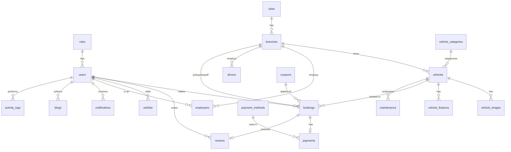

# Pakistani Car Rental Management System - Database Documentation

This document contains the ER Diagram, Database Schema Documentation, Table Relationship Explanations, and Sample Credentials for the generated `car_rental_db.sql`.

## ER Diagram

You can visualize the ER Diagram using Mermaid syntax. Paste the following code into [Mermaid Live Editor](https://mermaid.live/) or use a markdown viewer that supports Mermaid:

## Database Schema Documentation

The database is normalized to 3NF and includes the following tables:

*   **roles**: Stores user roles (Super Admin, Manager, Employee, Customer).
*   **users**: Core users table storing personal information, contact details, hashed passwords, and foreign key to `roles`.
*   **cities**: List of supported Pakistani cities.
*   **branches**: Rental branch locations in different cities, including address and manager information.
*   **vehicle_categories**: Vehicle classification (Economy, Compact, Sedan, SUV, Van, Luxury, VIP).
*   **vehicles**: Main vehicle inventory table. Stores details like brand, model, engine capacity, transmission, pricing, and availability. Linked to branches and categories.
*   **vehicle_images**: High-quality vehicle images, supporting multiple images per vehicle.
*   **vehicle_features**: Stores specific features of a vehicle (e.g., Air Conditioning, Power Steering).
*   **drivers**: Available drivers for rentals including driver option.
*   **coupons**: Promotional discount codes.
*   **bookings**: Core transactional table storing reservations. Links customers, vehicles, branches, drivers, and coupons. Includes pickup/drop-off dates and total cost.
*   **payment_methods**: Supported payment gateways/methods.
*   **payments**: Tracks payment transactions linked to bookings.
*   **reviews**: Customer feedback and ratings for specific vehicles and bookings.
*   **wishlist**: Customer's saved vehicles for future rentals.
*   **employees**: Staff details, salaries, and positions, linked to `users`.
*   **maintenance**: Vehicle service and maintenance history.
*   **notifications**: System alerts and messages for users.
*   **blogs**: Promotional or informative articles written by users (admins/managers).
*   **faqs**: Frequently asked questions.
*   **contact_messages**: Customer inquiries submitted through the website.
*   **newsletter**: Subscribed email addresses for marketing.
*   **settings**: Global system configuration settings.
*   **activity_logs**: Audit trail of user actions within the system.

## Table Relationship Explanation

*   **Users & Roles (1:N):** A role can be assigned to multiple users, but each user has exactly one role.
*   **Cities & Branches (1:N):** A city can have multiple rental branches.
*   **Branches & Vehicles (1:N):** A branch manages multiple vehicles in its inventory.
*   **Vehicle Categories & Vehicles (1:N):** A category contains multiple vehicles.
*   **Vehicles & Images/Features (1:N):** A single vehicle can have multiple images and features.
*   **Users & Bookings (1:N):** A customer can make multiple bookings over time.
*   **Vehicles & Bookings (1:N):** A vehicle can be booked multiple times by different customers.
*   **Branches & Bookings (1:N):** A branch handles multiple pickups and drop-offs.
*   **Bookings & Payments (1:1):** Each completed booking typically has one corresponding payment record.
*   **Bookings & Reviews (1:1):** A completed booking can result in one review.
*   **Coupons & Bookings (1:N):** A promotional coupon can be applied to multiple bookings.

## Sample Credentials

The `car_rental_db.sql` file contains pre-populated users with hashed passwords (bcrypt for "admin123", "manager123", "employee123", and "password123"). You can use the following credentials to log in:

### Super Admin
*   **Email:** `admin@carrental.pk`
*   **Password:** `admin123`

### Manager
*   **Email:** `manager1@carrental.pk`
*   **Password:** `manager123`
*(There are managers 1 to 3)*

### Employee
*   **Email:** `employee1@carrental.pk`
*   **Password:** `employee123`
*(There are employees 1 to 10)*

### Customer
*   **Email:** `customer1@gmail.com`
*   **Password:** `password123`
*(There are customers 1 to 50)*

## Importing into XAMPP phpMyAdmin

1. Open XAMPP Control Panel and ensure MySQL and Apache are running.
2. Navigate to `http://localhost/phpmyadmin/`.
3. Go to the "Import" tab.
4. Choose the `car_rental_db.sql` file.
5. Click "Import" at the bottom of the page.
6. The database will be created, and all tables will be populated with the provided Pakistani market data.
